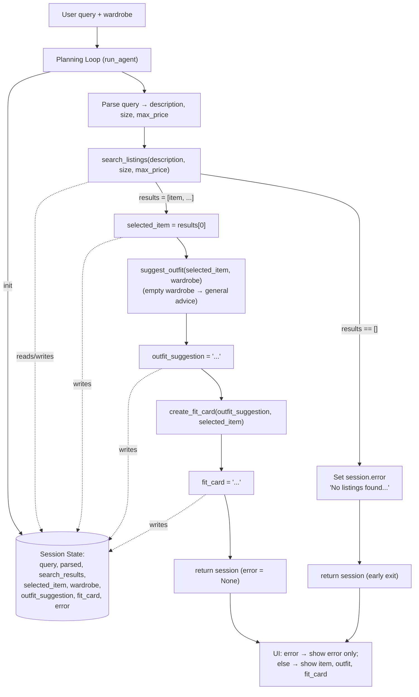

# FitFindr — planning.md

> Complete this document before writing any implementation code.
> Your spec and agent diagram are what you'll use to direct AI tools (Claude, Copilot, etc.) to generate your implementation — the more specific they are, the more useful the generated code will be.
> Your planning.md will be reviewed as part of your submission.
> Update it before starting any stretch features.

---

## Tools

List every tool your agent will use. For each tool, fill in all four fields.
You must have at least 3 tools. The three required tools are listed — add any additional tools below them.

### Tool 1: search_listings

**What it does:**
Searches the 40-item mock listings dataset (`utils/data_loader.load_listings()`) for secondhand items that match the user's keywords, optionally filtered by size and a price ceiling, and returns the matches ranked best-first by keyword relevance. This is a pure local filter/scoring function — no LLM call.

**Input parameters:**
- `description` (str): Free-text keywords describing the item the user wants, e.g. `"vintage graphic tee"`. Lowercased and split into tokens for scoring against each listing's `title`, `description`, and `style_tags`.
- `size` (str | None): A size string to filter by, e.g. `"M"`. Matching is case-insensitive and **token-based, not raw substring**, to avoid false positives: each listing's `size` is split on `/`, whitespace, and parentheses into tokens (so `"S/M"` → `["S","M"]`, `"XL (oversized)"` → `["XL","oversized"]`, `"US 8"` → `["US","8"]`), and a listing passes only if the requested size equals one of those tokens. This means `"M"` matches `"S/M"` and `"M/L"` but **not** `"XL"` (different token) and not unrelated strings that merely contain the letter, like the `"S"` in `"US 8"` or `"One Size"`. Numeric requests work the same way (`"8"` matches the `"8"` token in `"US 8"`). `None` skips size filtering entirely.
- `max_price` (float | None): Inclusive price ceiling. A listing passes only if `listing["price"] <= max_price`. `None` skips price filtering.

**What it returns:**
A `list[dict]` of matching listings, sorted by relevance score (highest first). Each dict has exactly the fields from the dataset: `id` (str), `title` (str), `description` (str), `category` (str: tops/bottoms/outerwear/shoes/accessories), `style_tags` (list[str]), `size` (str), `condition` (str: excellent/good/fair), `price` (float), `colors` (list[str]), `brand` (str | None), `platform` (str: depop/thredUp/poshmark). Listings that score 0 keyword matches are dropped. Returns an empty list `[]` if nothing matches — it never raises.

**What happens if it fails or returns nothing:**
The function itself returns `[]` rather than raising. The decision to stop belongs to the planning loop, not the tool: when the loop sees an empty list it sets `session["error"]` to a helpful, specific message (see Error Handling table) and returns early — it does NOT call `suggest_outfit` with empty input.

---

### Tool 2: suggest_outfit

**What it does:**
Takes the single chosen listing plus the user's wardrobe and asks the Groq LLM to write 1–2 concrete outfit suggestions, naming specific pieces the user already owns that pair well with the new item. Handles the empty-wardrobe case by switching to general styling advice instead.

**Input parameters:**
- `new_item` (dict): One listing dict (the top search result the loop selected). Its `title`, `category`, `style_tags`, and `colors` are formatted into the prompt so the model knows what it's styling.
- `wardrobe` (dict): A wardrobe dict with an `"items"` key holding a `list[dict]`. Each wardrobe item has `id`, `name`, `category`, `colors` (list), `style_tags` (list), and optional `notes`. May be empty (`{"items": []}`) — must be handled gracefully.

**What it returns:**
A non-empty `str` containing the outfit suggestion(s) in natural language. When the wardrobe has items, the string names real pieces from it (e.g. "pair it with your baggy straight-leg dark-wash jeans and white ribbed tank"). When the wardrobe is empty, the string is general styling advice for the item's vibe (what categories/colors pair well) and does not invent owned pieces.

**What happens if it fails or returns nothing:**
First checks `wardrobe["items"]`: if empty, it builds a "general styling advice" prompt rather than returning empty. If the LLM call raises or returns an empty/whitespace string, the tool returns a safe fallback string such as `"Couldn't generate a full outfit, but this piece works as a statement layer — pair it with neutral basics and let it lead."` so downstream `create_fit_card` always receives usable text. It never returns `""` and never raises.

---

### Tool 3: create_fit_card

**What it does:**
Turns the outfit suggestion + the chosen listing into a short, casual, shareable caption (Instagram/TikTok OOTD style) via the Groq LLM at higher temperature so output varies between runs.

**Input parameters:**
- `outfit` (str): The outfit-suggestion string returned by `suggest_outfit()`.
- `new_item` (dict): The chosen listing dict — `title`, `price`, and `platform` are woven into the caption once each.

**What it returns:**
A `str` of 2–4 sentences usable as a social caption: casual/authentic tone, mentions the item name, price, and platform naturally, captures the outfit vibe in specific terms, and reads differently for different inputs.

**What happens if it fails or returns nothing:**
Guards against an empty or whitespace-only `outfit` up front and, in that case, returns a descriptive error string like `"No outfit was provided, so no fit card could be created."` (it does NOT raise). If the LLM call fails or returns blank, it returns a minimal template caption built from `new_item` fields (e.g. `"Thrifted this {title} for ${price} on {platform} — styling notes coming soon."`) so the user always sees something.

---

### Additional Tools (if any)

Core build uses only the three tools above. Parsing the raw query into `{description, size, max_price}` lives inline in the planning loop (`_parse_query`, regex-based — see State Management), not as a separate tool.

**Stretch — Tool 4: `estimate_price_fairness`** (implemented; see Stretch Features section for full design).

---

### Tool 4 (stretch): estimate_price_fairness

**What it does:**
A pure local tool (no LLM) that judges whether a listing's price is fair by comparing it to similar items already in the dataset — same `category` and sharing at least one `style_tag`. Lets FitFindr tell the user "this is a great deal" / "fairly priced" / "a bit high vs. similar pieces."

**Input parameters:**
- `item` (dict): One listing dict (normally `session["selected_item"]`). Uses its `id` (to exclude itself), `category`, `style_tags`, `price`, and `title`.

**What it returns:**
A `dict` with: `verdict` (str: `"great deal"` / `"fair price"` / `"priced high"` / `"unknown"`), `message` (str, human-readable one-liner), `item_price` (float), `comparable_count` (int), `median_price` (float | None), `min_price` (float | None), `max_price` (float | None). Never raises.

**What happens if it fails or returns nothing:**
If fewer than 2 comparable listings exist, it returns `verdict="unknown"` with a message explaining there isn't enough comparable data — it does not guess or raise. Otherwise it compares `item_price` to the median of comparables: `<= 0.85×` median → great deal, within `±15%` → fair, `> 1.15×` → priced high.

---

## Planning Loop

**How does your agent decide which tool to call next?**

The loop is a fixed, linear pipeline with one early-exit branch — there is no open-ended "agent decides" reasoning. It runs in this exact order, reading and writing the `session` dict at each step:

1. **Initialize.** `session = _new_session(query, wardrobe)`.
2. **Parse the query.** Extract `description`, `size`, and `max_price` from the raw `query` and store them in `session["parsed"]`. Parsing uses lightweight rules: `max_price` is pulled from a regex matching `under $30` / `$30` / `30 dollars` (→ `30.0`, else `None`); `size` is pulled from a regex for `size M`, `size 8`, or a standalone token in a known size set (else `None`); `description` is the cleaned remaining text. (If parsing proves brittle, swap in an LLM parse call — same output shape.)
3. **Call `search_listings(description, size, max_price)`** and store the list in `session["search_results"]`.
   - **Branch — empty results:** `if not session["search_results"]:` set `session["error"] = "No listings found for '<query>'. Try removing the size or price filter, or using broader keywords like 'graphic tee' instead of a specific brand."` and **`return session` immediately.** Do not proceed.
   - **Branch — has results:** continue.
4. **Select the item.** `session["selected_item"] = session["search_results"][0]` (top-ranked match).
5. **Call `suggest_outfit(selected_item, wardrobe)`** and store the string in `session["outfit_suggestion"]`. This tool self-handles the empty-wardrobe case, so no branch is needed here — it always returns a usable string.
6. **Call `create_fit_card(outfit_suggestion, selected_item)`** and store the string in `session["fit_card"]`.
7. **Return** the completed `session` with `session["error"] is None`.

**How it knows it's done:** the pipeline is finite — after `create_fit_card` writes `fit_card`, the loop returns. There is exactly one terminal success state (all three outputs populated, `error is None`) and one terminal error state (`error` set, later outputs `None`). The only conditional branch is the empty-`search_results` check in step 3.

---

## State Management

**How does information from one tool get passed to the next?**

A single `session` dict (created by `_new_session`) is the one source of truth for the whole interaction. Each step reads what it needs from the dict and writes its output back, so the next step picks it up — tools are not chained by direct return-passing inside the loop; they communicate through `session`.

| Key | Written by | Read by | Holds |
|-----|-----------|---------|-------|
| `query` | `_new_session` | parse step | original raw user string |
| `parsed` | parse step | `search_listings` call | `{description, size, max_price}` |
| `search_results` | after `search_listings` | empty-check branch, select step | `list[dict]` of matches |
| `selected_item` | select step | `suggest_outfit`, `create_fit_card`, UI | the top listing dict |
| `wardrobe` | `_new_session` | `suggest_outfit` | user's wardrobe dict |
| `outfit_suggestion` | after `suggest_outfit` | `create_fit_card`, UI | outfit string |
| `fit_card` | after `create_fit_card` | UI | caption string |
| `error` | empty-results branch | UI / caller | `None` on success, message on early exit |

The contract for callers (e.g. `app.py`): **check `session["error"]` first.** If it's not `None`, the run ended early and `outfit_suggestion`/`fit_card` are `None`, so render only the error. Otherwise render `selected_item`, `outfit_suggestion`, and `fit_card`.

---

## Error Handling

For each tool, describe the specific failure mode you're handling and what the agent does in response.

| Tool | Failure mode | Agent response |
|------|-------------|----------------|
| search_listings | No results match the query (empty list — filters too strict or keywords unmatched) | Loop sets `session["error"]` to: *"No listings found for '<query>'. Try removing the size or price filter, or using broader keywords (e.g. 'graphic tee' instead of a brand name)."* and returns early. The UI shows this message in the listing panel and leaves the outfit/fit-card panels empty. No LLM calls are made. |
| suggest_outfit | Wardrobe is empty (`wardrobe["items"] == []`) | Tool does not error — it switches prompts and returns general styling advice: *"Your closet's empty, so here's how to style it from scratch: this piece reads <vibe> — pair it with <neutral basics / contrasting silhouettes> to anchor the look."* The pipeline continues normally to `create_fit_card`. |
| create_fit_card | Outfit input is missing or incomplete (empty/whitespace `outfit` string) | Tool returns a descriptive string (not an exception): *"No outfit suggestion was available, so I couldn't write a fit card — but this {title} (${price}, {platform}) is a strong solo piece worth grabbing."* The UI displays this in the fit-card panel so the user still gets a useful response. |

---

## Architecture

```
                          ┌──────────────────────────────────────────────┐
                          │                 SESSION STATE                 │
                          │  query · parsed · search_results ·            │
                          │  selected_item · wardrobe ·                   │
                          │  outfit_suggestion · fit_card · error         │
                          └──────────────────────────────────────────────┘
                                 ▲ writes        ▲ reads/writes      ▲
                                 │               │                   │
   User query + wardrobe         │               │                   │
        │                        │               │                   │
        ▼                        │               │                   │
   ┌─────────────────┐  init     │               │                   │
   │  PLANNING LOOP  │───────────┘               │                   │
   │   (run_agent)   │                           │                   │
   └─────────────────┘                           │                   │
        │                                        │                   │
        │ parse query → parsed{description,size,max_price}           │
        │                                        │                   │
        ├─► search_listings(description, size, max_price) ───────────┤
        │        │                                                   │
        │        │ search_results = []                               │
        │        ├──► [ERROR] session.error = "No listings found..." │
        │        │           │                                       │
        │        │           └────────────► return session ◄────────┐│
        │        │                                                  ││
        │        │ search_results = [item, ...]                     ││
        │        ▼                                                  ││
        │   selected_item = search_results[0] ──────────────────────┤│
        │        │                                                  ││
        ├─► suggest_outfit(selected_item, wardrobe) ─────────────────┤│
        │        │   (empty wardrobe → general advice, no branch)   ││
        │        ▼                                                  ││
        │   outfit_suggestion = "..." ──────────────────────────────┤│
        │        │                                                  ││
        └─► create_fit_card(outfit_suggestion, selected_item) ───────┤│
                 │                                                  ││
                 ▼                                                  ││
            fit_card = "..." ─────────────────────────────────────── │
                 │                              error path returns here┘
                 ▼
        return session  (error = None, all outputs populated)
                 │
                 ▼
        UI (app.py): if error → show error only;
                     else → show selected_item · outfit_suggestion · fit_card
```

The same flow as a Mermaid diagram:



---

## AI Tool Plan

**Milestone 3 — Individual tool implementations:**

I'll use **Claude** for all three tools, implementing and verifying one at a time so a bug in one doesn't hide a bug in another.

- **search_listings:** I'll paste the *Tool 1* block above (inputs, return value with the full field list, failure mode) plus the `load_listings()` docstring from `utils/data_loader.py`. I expect Claude to produce a pure function that (1) loads listings, (2) filters by `max_price` and case-insensitive substring `size`, (3) scores remaining listings by keyword overlap of `description` tokens against `title` + `description` + `style_tags`, (4) drops score-0 items, (5) sorts descending and returns the dicts. **Verify before trusting:** read the code to confirm it filters by all three parameters and returns `[]` (not `None`/exception) on no match; then test 3 queries — `"vintage graphic tee under $30"` (expect tee results, all ≤ $30), `"90s track jacket size M"` (size filter applied), and `"designer ballgown size XXS under $5"` (expect `[]`).
- **suggest_outfit:** I'll give Claude the *Tool 2* block plus a sample `new_item` dict and the example wardrobe shape. I expect a function that branches on `wardrobe["items"]` empty vs non-empty, formats the wardrobe into the prompt, calls Groq, and never returns `""`. **Verify:** run it once with `get_example_wardrobe()` (output should name real wardrobe pieces) and once with `get_empty_wardrobe()` (output should be general advice, not invented items), confirm both are non-empty strings.
- **create_fit_card:** I'll give Claude the *Tool 3* block. I expect a higher-temperature caption generator that mentions title, price, and platform once each and guards empty `outfit`. **Verify:** call it twice with the same item and check the captions differ; call it with `outfit=""` and confirm it returns the descriptive error string, not an exception.

**Milestone 4 — Planning loop and state management:**

I'll use **Claude**, giving it the *Planning Loop*, *State Management*, *Error Handling* sections **and the agent diagram above** as the prompt, plus the `_new_session` and `run_agent` stubs from `agent.py`. I expect it to implement `run_agent` as the 7-step linear pipeline with the single early-exit branch on empty `search_results`, writing every output back into `session`. **Verify before trusting:** confirm (a) the empty-results branch sets `session["error"]` and returns before any LLM call, (b) `selected_item = search_results[0]`, (c) each tool result lands in the correct session key, and (d) it never calls `suggest_outfit` with empty input. Then run `python agent.py` and check the happy path populates all three outputs with `error is None`, and the `"designer ballgown size XXS under $5"` path returns with `error` set and `outfit_suggestion`/`fit_card` as `None`.

---

## A Complete Interaction (Step by Step)

Write out what a full user interaction looks like from start to finish — tool call by tool call. Use a specific example query.

**What FitFindr does (in brief):** FitFindr is a secondhand-shopping stylist — the user describes an item they want and shares their wardrobe, and the agent finds a real listing, suggests how to style it with pieces they already own, and writes a shareable social caption. The user's query triggers `search_listings` first; only if that returns at least one match does the top result trigger `suggest_outfit`, whose styling text then triggers `create_fit_card`. If `search_listings` comes back empty the loop stops there with a helpful "try broader keywords or drop a filter" message and never calls the LLM tools, while `suggest_outfit` (empty wardrobe → general advice) and `create_fit_card` (missing outfit → template caption) each fall back to safe default text instead of failing, so the user always gets a usable response.

**Example user query:** "I'm looking for a vintage graphic tee under $30. I mostly wear baggy jeans and chunky sneakers. What's out there and how would I style it?"

**Step 0 — Initialize & parse:** `run_agent` builds a fresh `session`. The parse step extracts `description="vintage graphic tee"`, `size=None` (no size stated), `max_price=30.0` (from "under $30") and stores them in `session["parsed"]`. (The "baggy jeans / chunky sneakers" detail comes from the wardrobe, not the search query.)

**Step 1 — search_listings:** The loop calls `search_listings("vintage graphic tee", None, 30.0)`. It filters out everything over $30, scores the rest by keyword overlap, and returns a ranked list. Several items match all three tokens — e.g. `lst_002` *"Y2K Baby Tee"* ($18), `lst_006` *"Graphic Tee — 2003 Tour Bootleg Style"* ($24), and `lst_033` *"Vintage Band Tee"* ($19) all carry the `"graphic tee"` and `"vintage"` tags. *Which one ranks first is determined by the scoring function I implement in Milestone 3, so the exact top hit here is illustrative; I'll re-confirm it against real output once `search_listings` exists.* For this walkthrough assume the top hit is `lst_002` — `$18.00`, style_tags `["y2k","vintage","graphic tee","cottagecore"]`, platform `depop`. The list is non-empty, so `session["search_results"]` is set and the loop does **not** take the error branch.

**Step 2 — select:** The loop sets `session["selected_item"] = search_results[0]` (the $18 Y2K butterfly tee).

**Step 3 — suggest_outfit:** The loop calls `suggest_outfit(selected_item, wardrobe)` with the example wardrobe (which contains baggy dark-wash jeans, a white ribbed tank, chunky sneakers, etc.). The Groq LLM returns something like: *"Tuck the butterfly baby tee into your baggy straight-leg dark-wash jeans and finish with the chunky white sneakers for an easy Y2K street look. For a softer take, layer it under the oversized flannel."* This string is stored in `session["outfit_suggestion"]`.

**Step 4 — create_fit_card:** The loop calls `create_fit_card(outfit_suggestion, selected_item)`. The LLM returns a casual caption mentioning the item, price, and platform once each, e.g.: *"Butterfly baby tee summer 🦋 Snagged this Y2K find for $18 on Depop and it's already my most-worn piece. Baggy jeans, chunky sneakers, done. Thrift > fast fashion every time."* Stored in `session["fit_card"]`.

**Step 5 — return:** `session["error"]` is `None` and all three outputs are populated, so the loop returns `session`.

**Final output to user:** The Gradio UI shows three panels — (1) the listing: *Y2K Baby Tee — Butterfly Print, $18.00, depop, condition: excellent*; (2) the outfit suggestion text from Step 3; (3) the shareable fit-card caption from Step 4.

---

## Stretch Features

Three stretch features are implemented. Each is designed to keep the core
pipeline intact — they add to the `session` dict and the planning loop rather
than rewrite it.

### A. Price comparison tool (`estimate_price_fairness`)

Full spec in the *Tool 4* block above. **Wiring:** after the loop selects
`selected_item` (Step 4 of the loop), it calls `estimate_price_fairness(selected_item)`
and stores the result dict in `session["price_check"]`. This is non-fatal — if
it can't judge (too few comparables) the run continues normally; the verdict is
extra context the UI can surface. It runs *before* the LLM tools so the fit card
prompt could optionally mention the deal.

### B. Retry with fallback (loosen constraints on empty search)

**Change to the planning loop's Step 3.** Instead of erroring the instant
`search_listings` returns `[]`, the loop escalates through looser searches and
records what it changed:

1. Attempt 1 — full constraints: `(description, size, max_price)`.
2. If empty and a `size` was set → Attempt 2 drops size: `(description, None, max_price)`. Note: *"removed the size filter (M)"*.
3. If still empty and a `max_price` was set → Attempt 3 drops price too: `(description, None, None)`. Note: *"removed the price filter ($30)"*.

Size is dropped before price because the dataset's size strings are messy and
the most common cause of a zero-match. The first attempt that returns results
wins; its results become `session["search_results"]` and the loop continues
normally. The list of adjustments is stored in `session["adjustments"]` (and a
human sentence in `session["search_note"]`) so the UI can tell the user *"No
exact match, so I removed the size filter (M) — here's the closest find."* Only
if **every** attempt is empty does the loop set `session["error"]` and stop, as
before. `_search_with_fallback(parsed)` encapsulates this and returns
`(results, adjustments)`.

**Why this is a real planning decision:** the agent's behavior now varies three
ways on the same code path — exact match, relaxed match (with disclosure), or
genuine no-match — based entirely on what the tool returned.

### C. Style profile memory (cross-session)

A small persistence layer (`utils/profile_store.py`) so a returning user doesn't
re-enter their wardrobe.

- **Storage:** one JSON file per user at `data/profiles/<user_id>.json` holding
  `{user_id, wardrobe, style_preferences, updated_at}`. `style_preferences` is
  derived by counting `style_tags` across the wardrobe and keeping the most
  common (so the agent "remembers" the user leans, e.g., vintage/streetwear).
- **API:** `save_profile(user_id, wardrobe)`, `load_profile(user_id)`,
  `get_remembered_wardrobe(user_id)`, `derive_style_preferences(wardrobe)`.
- **Hook in `run_agent`:** signature gains an optional keyword `user_id=None`
  (backward compatible — existing `run_agent(query, wardrobe)` calls are
  unchanged). If `wardrobe` is empty/None and a `user_id` is given, the loop
  loads the remembered wardrobe. If a wardrobe *is* supplied with a `user_id`,
  it is saved for next time. Failure to read/write a profile never breaks a run
  — it falls back to the passed (or empty) wardrobe.

**Failure handling:** a corrupt or missing profile file returns `None` from
`load_profile` rather than raising; the run proceeds with whatever wardrobe was
passed.
